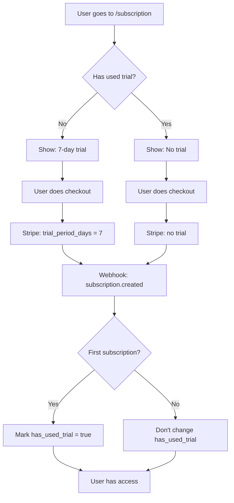

# One-Time Trial Implementation (First Time Only)

## 📋 Summary

A system has been implemented that offers the 7-day trial **only the first time** a user subscribes. If the user cancels and resubscribes later, they will no longer have access to the free trial.

## 🎯 Behavior

### First Subscription
- ✅ New user → **7 days free trial**
- ✅ No charge until after the trial
- ✅ Can cancel during trial at no cost

### Resubscription (after canceling)
- ❌ User who already used their trial → **No trial, charged immediately**
- ✅ Can still cancel anytime
- ✅ Clear message that trial has already been used

## 🗄️ Database Changes

### New Migration: `20260207000001_add_trial_tracking.sql`

Adds two columns to the `profiles` table:

| Column | Type | Description |
|---------|------|-------------|
| `has_used_trial` | BOOLEAN | `true` if user has already used their trial (default: `false`) |
| `first_subscription_date` | TIMESTAMP | Date of first subscription |

### Automatic Behavior
- ✅ Marks `has_used_trial = true` when user activates their first subscription
- ✅ Existing users with active subscriptions are automatically marked
- ✅ Records the date of first subscription

## 🔧 Modified Files

### 1. `/src/models/user.ts`
Added to User interface:
```typescript
has_used_trial?: boolean;
first_subscription_date?: string | null;
```

### 2. `/src/app/api/stripe/checkout/route.ts`
**Main changes:**
- Checks `has_used_trial` before creating checkout session
- Only includes `trial_period_days: 7` if `has_used_trial === false`
- Logs for trial eligibility debugging

**Logic:**
```typescript
// Check if user has already used their trial
const { data: profile } = await supabaseAdmin
  .from('profiles')
  .select('has_used_trial')
  .eq('id', userId)
  .single();

const hasUsedTrial = profile?.has_used_trial ?? false;

// Only add trial if user hasn't used it before
if (!hasUsedTrial) {
  subscriptionData.trial_period_days = 7;
}
```

### 3. `/src/app/api/stripe/webhook/route.ts`
**Main changes:**
- Updates `has_used_trial = true` when first subscription is created/activated
- Records `first_subscription_date` on first subscription
- Only updates these fields if not already set

**Logic:**
```typescript
// Mark has_used_trial as true if this is their first active/trialing subscription
if (!existingProfile?.has_used_trial && 
    (subscriptionStatus === 'ACTIVE' || subscriptionStatus === 'TRIALING')) {
  updateData.has_used_trial = true;
}

// Set first_subscription_date if not already set
if (!existingProfile?.first_subscription_date && 
    (subscriptionStatus === 'ACTIVE' || subscriptionStatus === 'TRIALING')) {
  updateData.first_subscription_date = new Date().toISOString();
}
```

### 4. `/src/app/subscription/page.tsx`
**Visual changes:**
- "7-Day Free Trial" banner only appears if `has_used_trial === false`
- Features list includes "7-day free trial" only for eligible users
- Button changes from "Start Free Trial" to "Subscribe Now" based on eligibility
- Informational text below button adapts
- FAQ updated with different messages for users with/without trial

**UI States:**

| Has Used Trial | Banner | Button | Text |
|----------------|--------|-------|-------|
| `false` | ✅ Visible | "Start Free Trial" | "7-day free trial, then $X" |
| `true` | ❌ Hidden | "Subscribe Now" | "Billed $X per month/year" |

### 5. `/src/components/SubscriptionBlockModal.tsx`
- Removed "7-day free trial available" text from footer
- Now only shows "Cancel anytime"

## 🚀 How to Apply

### 1. Apply Migration

**Option A: Supabase Local**
```bash
supabase db reset
```

**Option B: Supabase Cloud (Dashboard)**
1. Go to SQL Editor in your project
2. Copy and paste `supabase/migrations/20260207000001_add_trial_tracking.sql`
3. Execute the query

**Option C: CLI**
```bash
supabase db push
```

### 2. Verify Migration

```sql
-- Verify columns
SELECT column_name, data_type, column_default
FROM information_schema.columns
WHERE table_name = 'profiles' 
  AND column_name IN ('has_used_trial', 'first_subscription_date');

-- View user status
SELECT 
  id,
  subscription_status,
  has_used_trial,
  first_subscription_date
FROM profiles
LIMIT 10;
```

### 3. Restart Server
```bash
npm run dev
```

## 🧪 Testing the System

### Case 1: New User (First Time)

```sql
-- Verify initial state
SELECT id, email, has_used_trial 
FROM auth.users 
JOIN profiles ON auth.users.id = profiles.id
WHERE email = 'your-email@example.com';
-- Expected result: has_used_trial = false
```

1. Log in with a new user
2. Go to `/subscription`
3. **You should see:**
   - ✅ "7-Day Free Trial" banner
   - ✅ "Start Free Trial" button
   - ✅ Text "7-day free trial, then $X"
   - ✅ "7-day free trial" feature in the list
4. Do checkout → Stripe will show 7-day trial

### Case 2: User Who Already Used Their Trial

```sql
-- Simulate user who already used their trial
UPDATE profiles
SET 
  has_used_trial = TRUE,
  first_subscription_date = NOW()
WHERE id = 'your-user-id-here';
```

1. Log in with the user
2. Go to `/subscription`
3. **You should see:**
   - ❌ NO trial banner
   - ✅ "Subscribe Now" button
   - ✅ Text "Billed $X per month/year"
   - ❌ NO "7-day free trial" in the list
   - ✅ FAQ explains trial was already used
4. Do checkout → Stripe will charge immediately (no trial)

### Case 3: User with Active Subscription

```sql
-- View users with active subscription
SELECT 
  id,
  subscription_status,
  has_used_trial,
  first_subscription_date
FROM profiles
WHERE subscription_status IN ('ACTIVE', 'TRIALING');
```

**Expected result:**
- All should have `has_used_trial = true`
- All should have `first_subscription_date` set

## 📊 Complete Flow



## 🔍 Debugging Logs

Server console logs will show:

```
POST stripe/checkout: Trial eligibility check {
  userId: 'xxx',
  hasUsedTrial: false,
  willOfferTrial: true
}
```

```
POST stripe/webhook: Marking trial as used for user { userId: 'xxx' }
POST stripe/webhook: Setting first subscription date for user { userId: 'xxx' }
```

## 📋 Edge Cases

### User Cancels During Trial
- ✅ `has_used_trial` remains `true`
- ✅ If they resubscribe, they will NOT have trial again
- ✅ This is intentional - trial is per user, not per subscription

### User with Multiple Cancellations
- ✅ First subscription → With trial
- ✅ Second subscription (after canceling) → No trial
- ✅ Third subscription → No trial
- ✅ etc.

### Existing Users
The migration automatically:
- ✅ Marks `has_used_trial = true` for users with `ACTIVE` or `TRIALING`
- ✅ Users without subscription keep `has_used_trial = false`

## 🛠️ Troubleshooting

### User should have trial but doesn't see it
```sql
-- Verify status
SELECT id, has_used_trial FROM profiles WHERE id = 'user-id';

-- If has_used_trial is true but shouldn't be:
UPDATE profiles 
SET has_used_trial = false 
WHERE id = 'user-id';
```

### User sees trial but shouldn't
```sql
-- Mark as already used
UPDATE profiles 
SET 
  has_used_trial = true,
  first_subscription_date = NOW()
WHERE id = 'user-id';
```

### Verify Stripe Checkout
In server logs look for:
```
Trial eligibility check { hasUsedTrial: ..., willOfferTrial: ... }
```

### Verify Webhook
In server logs look for:
```
Marking trial as used for user
Setting first subscription date for user
```

## ✅ Verification Checklist

- [ ] Migration applied correctly
- [ ] Columns `has_used_trial` and `first_subscription_date` exist
- [ ] New user sees trial banner
- [ ] New user sees "Start Free Trial" button
- [ ] New user gets 7-day trial in Stripe
- [ ] After first subscription, `has_used_trial = true`
- [ ] User who already used trial does NOT see banner
- [ ] User who already used trial sees "Subscribe Now"
- [ ] User who already used trial does NOT get trial in Stripe
- [ ] FAQ updates according to user status
- [ ] Webhook updates fields correctly

## 📚 References

- Stripe Checkout API: https://stripe.com/docs/api/checkout/sessions/create
- Subscription Trial Periods: https://stripe.com/docs/billing/subscriptions/trials
- Webhook Events: https://stripe.com/docs/api/events

---

**Implemented:** February 7, 2026
**Version:** 1.0
